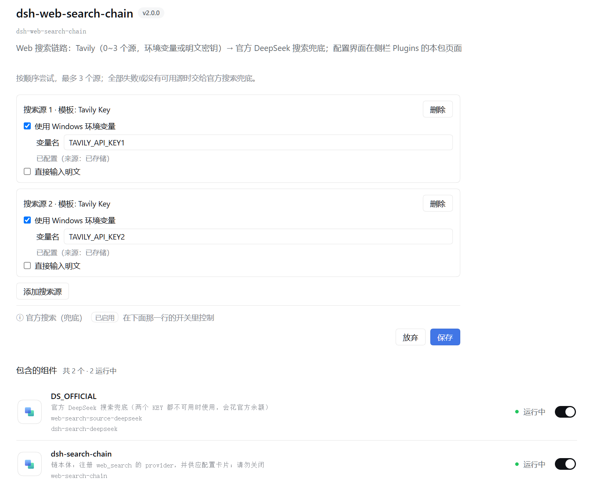

# dsh-websearch-tavily-keys-select

[中文](#中文) ｜ [English](#english)

给 DeepSeek Harness 的 `web_search` 加一条**多源链路**：按顺序尝试最多 **3 个 Tavily 源**（密钥可取 Windows 环境变量，也可直接输入明文），**全部失败或一个都没配**时交给**官方 DeepSeek 搜索**兜底。配置卡片就在**侧栏 Plugins → `dsh-websearch-tavily-keys-select`** 的包页上。

> **改配置不用重启 DSH**：链路每次搜索都重读配置文档。



> ☝️ 真实截图（2026-09-29）：每个源二选一 —— **使用 Windows 环境变量**（填变量名，如 `TAVILY_API_KEY1`）或**直接输入明文**；
> 状态行会显示 `已配置（来源：已存储 / 环境变量 / 未配置）`。页面下半部分「包含的组件」列出两个行包
> （`DS_OFFICIAL` 官方兜底 / `dsh-search-chain` 链本体）与各自的**运行开关**。

---

## 中文

### 它解决什么

- **省钱**：Tavily 有自己的额度，官方 DeepSeek 搜索**会花官方余额** ⇒ 平时走 Tavily，兜底开关可以随时关掉。
- **多个 key 轮换**：最多 3 个源按顺序试，某个 key 失效或超时会**自动试下一个**，不用手改配置。
- **密钥不进 DSH 的明文**：优先用 **Windows 环境变量**（密钥留在系统里）；确实要临时试，也能直接输入明文（进 DSH 凭据域，见下）。

### 安装

```bash
dsh plugin --profile <你的 profile> add dsh-websearch-tavily-keys-select
```

装完**重启 DSH**（打包版没有「刷新页面」）。它会自动带上两个行包：

| 行包 | 作用 |
|---|---|
| `dsh-search-chain` | **链本体**：注册 `web_search` 的 provider，并供应上面那张配置卡片 |
| `dsh-search-deepseek` | **官方兜底**：Tavily 全失败/未配置时用官方搜索（**花官方余额**） |

> 这两个行包**不需要单独安装**，也不建议单独装 —— 装错了会少一半功能。

### 怎么配

| 密钥来源 | 怎么写 | 适合 |
|---|---|---|
| **Windows 环境变量**（推荐） | 勾「使用 Windows 环境变量」并填变量名（如 `TAVILY_API_KEY1` / `TAVILY_API_KEY2`） | 不想把明文交给 DSH |
| **直接输入明文** | 勾「直接输入明文」并填写 | 临时试用 |
| 环境里本来就有 | 不用填，链路会识别同名环境变量 | 已有系统级 key |

- **源的顺序 = 尝试顺序**；最多 **3 个**源；每个源失败自动降级到下一个。
- **官方兜底**：页面里 `DS_OFFICIAL` 那个开关（默认开）——**关掉就不花官方余额**。
- 保存后**立即生效**（下一次搜索就用新配置），无需重启。

### 配置存在哪 / 怎么排查

| 路径 | 作用 |
|---|---|
| `$DSH_HOME\web-search-chain.json` | **源列表（唯一真源）**，每次搜索重读；损坏或超 64 KB 时按默认值工作 |
| `$DSH_HOME\.credentials.yaml` | **明文密钥**进 DSH 凭据域（`refs` 段，引用名 `WEB_SEARCH_TAVILY_<n>`） |
| `$DSH_HOME\web-search-chain.log` | **审计日志**：哪条源服务了、何时走了官方兜底 |

### 兼容性与合规

- **实测环境**：DSH 桌面壳 `0.1.7-rc.2`（Windows）。
- host 半边**零 `@deepseek-ai` 静态 import**（官方兜底那一次是**懒动态 import**，只有真要走兜底时才加载）。
- 客户端半边只 `require` `react` / `react-dom` / `react/jsx-runtime`（基座）；checkbox / input / button / 标签**全部自包含**（官方 practices 禁止 client 半边 require 任何 Harness Client 包）。
- `ModuleLoader` 的 factory id **等于包名**；`apply` 与所有回调**绝不外抛**（client entry 一旦 failed 会撞「每条 client entry 必须 active」的全有全无启动门禁）。
- 包内声明 `dsh.bundle.patch`（官方交付单位；缺它 `install_bundle` 会回滚整次安装）。

### 测试（离线，任意 cwd）

```powershell
node test\run-all.mjs         # 7 个测试文件（含 manifest 11/11、route 25/25）
node test\verify-client.mjs   # 客户端验证台：53/53（含合规守卫、注册 key 动态比对）
node test\make-mutants.mjs    # 变异测试：5/5 必须被杀
```

> ⚠️ 别用 `node --test`：本机沙箱禁命名管道，runner 会 spawn EPERM 并给出误导性的 `# fail 1`。

---

## English

A **multi-source web-search chain** for DeepSeek Harness: try up to **3 Tavily sources** in order (keys taken from Windows environment variables or typed in as plaintext), and fall back to the **official DeepSeek search** when every source fails or none is configured. The configuration card lives on the **Plugins → `dsh-websearch-tavily-keys-select`** page in the sidebar.

> **No restart needed** to change the configuration — the chain re-reads its config document on every search.


### Install

```bash
dsh plugin --profile <your-profile> add dsh-websearch-tavily-keys-select
```

Restart DSH afterwards. Two row packages come along automatically: **`dsh-search-chain`** (the chain itself + this configuration card) and **`dsh-search-deepseek`** (official fallback — **spends official credit**). Do not install them separately.

### Configure

- **Windows environment variable** (recommended): tick “使用 Windows 环境变量” and enter the variable name (e.g. `TAVILY_API_KEY1`).
- **Plaintext**: tick “直接输入明文” and type the key (it is stored in DSH's credential domain, never echoed back).
- **Source order = try order**, at most **3** sources; a failing source falls through to the next.
- The **`DS_OFFICIAL` switch** (on by default) controls the official fallback — turn it off to stop spending official credit.

| Runtime file | Purpose |
|---|---|
| `$DSH_HOME\web-search-chain.json` | the source list (single source of truth), re-read on every search |
| `$DSH_HOME\.credentials.yaml` | plaintext keys, under `refs` as `WEB_SEARCH_TAVILY_<n>` |
| `$DSH_HOME\web-search-chain.log` | audit log: which source served, when the fallback ran |

### Compliance

Host side has **zero `@deepseek-ai` static imports** (the official fallback is a lazy dynamic import). The client half only requires `react` / `react-dom` / `react/jsx-runtime` and is otherwise self-contained; its `ModuleLoader` factory id equals the package name, and `apply` never throws. The package declares `dsh.bundle.patch`.

### Tests

```powershell
node test\run-all.mjs         # 7 files (manifest 11/11, route 25/25)
node test\verify-client.mjs   # 53/53, including compliance guards
node test\make-mutants.mjs    # 5/5 mutants must be killed
```

---

### License

MIT
